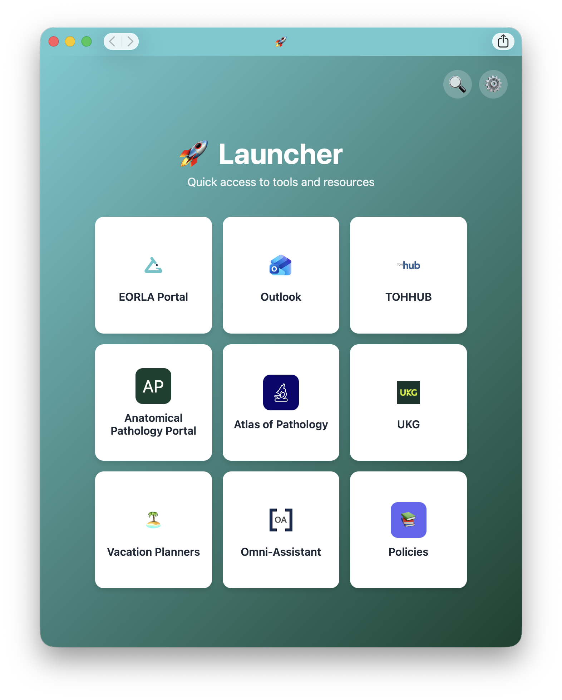

# 🚀 Web Launcher

A customizable web app launcher for quick access to internal tools, policies, and resources. Perfect for company intranets or personal productivity dashboards.



## Features

- 🎯 **Smart Sorting** - Links auto-sort based on your click frequency
- 🆕 **NEW Badge** - Highlights unclicked links so nothing gets missed
- 🔍 **Search** - Quickly find any link even when the grid is full
- ⚙️ **Customizable** - Users can add personal links stored in localStorage
- 📄 **Policy Directory** - Searchable database of company policies
- 💾 **Import/Export** - Share configurations via JSON
- 📱 **PWA Ready** - Install as a web app on desktop or mobile
- 🎨 **Flexible Icons** - Supports emojis, image URLs, and custom colors

## Demo

**Live Demo:** [https://eorla.jjjp.ca]

## Quick Start

### Option 1: GitHub Pages (Recommended)
1. Fork this repository
2. Go to Settings → Pages
3. Deploy from `main` branch
4. Access at `https://yourusername.github.io/workspace-hub`

### Option 2: Self-Hosted
1. Download `index.html` and `data.json`
2. Upload to your web server
3. Navigate to the URL

## Customization

### Adding Links (Admin)
Edit `data.json` to add default links for all users:

```json
{
  "links": [
    {
      "id": 1,
      "name": "Company Portal",
      "url": "https://portal.company.com",
      "icon": "🏢",
      "color": "blue",
      "isNew": true
    }
  ]
}
```

**Icon Options:**
- Emoji: `"icon": "🚀"`
- Image URL: `"icon": "https://example.com/logo.png"`
- Local image: `"icon": "/icons/custom.png"`

**Color Options:**
- Preset: `"color": "blue"` (blue, green, purple, orange, red, indigo, pink, teal)
- Hex code: `"color": "#3b82f6"`

### Adding Policies (Admin)
Edit `data.json` to add company policies:

```json
{
  "policies": [
    {
      "id": 1,
      "title": "Remote Work Policy",
      "category": "HR",
      "url": "https://docs.company.com/remote"
    }
  ]
}
```

### User Customization
Users can:
- Add personal links (stored in localStorage)
- Export their configuration as JSON
- Import configurations from JSON files
- Reset to defaults

## Configuration

### Mark Links as NEW
Add `"isNew": true` to show the NEW badge:
```json
{
  "id": 8,
  "name": "New Tool",
  "url": "https://newtool.com",
  "icon": "✨",
  "color": "purple",
  "isNew": true
}
```

The badge disappears after the first click.

### Grid Layout
- Maximum 8 links visible + 1 Policies tile
- Links sort by: NEW badge first → Click count (descending)
- Use Search to access all links when 9+ exist

## Browser Support

- Chrome/Edge (recommended)
- Firefox
- Safari
- Mobile browsers

## Privacy

- All user data stored in **localStorage** (browser-only)
- No tracking or analytics
- No server-side storage
- No cookies

## Contributing

Contributions welcome! Please:
1. Fork the repo
2. Create a feature branch
3. Submit a pull request

### Ideas for Contributions
- Additional icon packs
- Dark mode
- Different grid sizes (2x2, 4x4)
- Analytics dashboard
- Multi-language support

## Changelog

See [CHANGELOG.md](CHANGELOG.md) for version history.

## License

MIT License - feel free to use and modify for your organization.

## Support

- Open an issue for bugs or feature requests
- Submit your exported JSON if you want to contribute links
- Star ⭐ the repo if you find it useful!

## Credits

Created for workplace productivity. Contributions welcome from the community.
